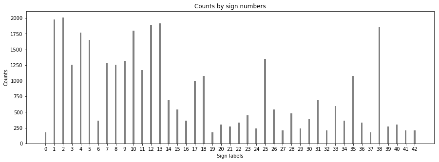
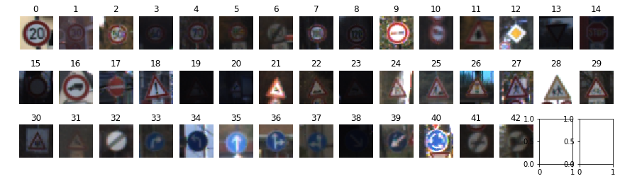
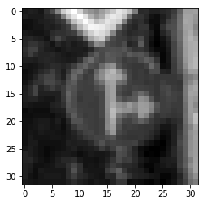
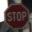

# **Traffic Sign Recognition** 

---

**Build a Traffic Sign Recognition Project**

The goals / steps of this project are the following:
* Load the data set (see below for links to the project data set)
* Explore, summarize and visualize the data set
* Design, train and test a model architecture
* Use the model to make predictions on new images
* Analyze the softmax probabilities of the new images
* Summarize the results with a written report

---
You're reading it! and here is a link to my [project code](https://github.com/weicheng113/CarND-Traffic-Sign-Classifier-Project/blob/master/Traffic_Sign_Classifier.ipynb)

### Dataset Summary & Exploration
#### 1. Summary
I used the numpy library to calculate summary statistics of the traffic signs data set:

* The size of training set is 34799
* The size of the validation set is 4410
* The size of test set is 12630
* The shape of a traffic sign image is (32, 32, 3)
* The number of unique classes/labels in the data set is 43

#### 2. Exploration

Here is an exploratory visualization of the data set. It is a bar chart showing how the data is distributed, with x-axis being sign label numbers and y-axis being counts. I also plot 43 image samples from different classes with its classId as title on top.

### Design and Test a Model Architecture

#### 1. Preprocessing

As a first step, I decided to convert the images to grayscale because it results better training speed and based on my experiments, it has a slightly better accuracy. 

Here is an example of a traffic sign image before and after grayscaling.

As a last step, I normalized the image data to the range of [0.1, 0.9] because it converges quicker in my experiments than (pixel - 128)/float(128), which is the range of [-1, 1]. Here is an example of a grayscaled traffic sign image and its normalized image.

#### 2. Model Architecture

My final model consisted of the following layers:

| Layer         		|     Description	        					| 
|:---------------------:|:---------------------------------------------:| 
| Input         		| 32x32x1 RGB image   							| 
| Convolution 5x5     	| 1x1 stride, valid padding, outputs 28x28x16 	|
| RELU					|												|
| Max pooling	      	| 2x2 stride, valid padding, outputs 14x14x16 				|
| Convolution 5x5     	| 1x1 stride, valid padding, outputs 10x10x32 	|
| RELU					|												|
| Dropout	      	| 0.75 keep probability, outputs 10x10x32 				|
| Convolution 3x3     	| 1x1 stride, valid padding, outputs 8x8x64 	|
| RELU					|												|
| Max pooling	      	| 2x2 stride, valid padding, outputs 4x4x64 				|
| Flatten 	    | outputs 1024      									|
| Fully connected		| outputs 200        									|
| RELU					|												|
| Fully connected		| outputs 100        									|
| RELU					|												|
| Fully connected		| outputs 43        									|

#### 3. Model Training

To train the model, I used an AdamOptimizer with learning rate 0.001 and minimizing the loss by softmax and cross entropy with the logits from the model above. I set batch size of 128 and epochs to 10 for the training.

#### 4. My Approach

My final model results were:
* training set accuracy of 0.996
* validation set accuracy of 0.949
* test set accuracy of 0.932

I started with the original LeNet model from Udacity CNN course, 2 conv layers followed by 3 full connected layers. With that I can only get to slight more than 80% accuracy. So I tried to turn learning rate, add more conv layers and increase the depth of conv layers. From my experiments, I received a good start accuracy rate with learning rate of 0.05, but it was not stable towards the end. Adding one more conv layer and increasing the depth of conv layers help to improve accuracy. I eventually settled with 3 conv layers and reasonable depths of conv layers, as there was not much improvement in accuracy by depth increase but it took longer to train. With these configurations, I was able to get to more than 90% accuracy with 10 epochs. I then played with image grayscaling and adjusted image pixel normalization from the range of [-1, 1], (x-128)/128, to the range [0.1, 0.9], (0.9 - 0.1)*images/255+0.1. With this, I was finally able to reach around 95% accuracy on validation dataset. Beside, I added a dropout activation to the second conv layer to prevent overfitting and from the final accuracy results on three dataset above, the model performed ok.
 

### Test the Model on New Images

#### 1. New Images

Here are six German traffic signs that I found on the web:

  
  

The first, fourth and fifth images are difficult, as the first one is quite dark, the fourth being a complicated drawing and the fifth of Speed limit 70km/h not being clearly depicted. And the rest three images are relatively easy to identify. It will be interesting to see how well the model will predicate on these new images.

#### 2. The Model's Prediction Performance on New Images

Here are the results of the prediction:

| Image			        |     Prediction	        					| 
|:---------------------:|:---------------------------------------------:| 
| Stop sign      		| 14 Stop sign   									| 
| No entry     			| 17 No entry 										|
| General caution					| 18 General caution											|
| Slippery road	      		| 23 Slippery road					 				|
| Speed limit (70km/h)			| 4 Speed limit (70km/h)      							|
| Ahead only	      		| 35 Ahead only					 				|

The model was able to correctly guess 6 of the 6 traffic signs, which gives an accuracy of 100%. This compares favorably to the accuracy on the test set of 0.930.

#### 3. The Model's Certainty on New Image Predictions

The code for making predictions on my final model is located in the 11th cell of the Ipython notebook. The top five softmax for the six sample images are as follows. From the following tables, we can see that the model are quite certain with all the predictions, as the probability value are ranging from 0.99 to 1.00 for all the six images.

The first stop sign:

| Probability         	|     Prediction	        					| 
|:---------------------:|:---------------------------------------------:| 
| 9.99985337e-01        			| 14 Stop   									| 
| 4.51564392e-06     				| 15 No vehicles 										|
| 3.54532608e-06					| 33 Turn right ahead											|
| 2.48102515e-06	      			| 1 Speed limit (30km/h)					 				|
| 1.33502806e-06				    | 38 Keep right      							|

The second no entry sign:

| Probability         	|     Prediction	        					| 
|:---------------------:|:---------------------------------------------:| 
| 1.00000000e+00         			| 17 No entry   									| 
| 5.04085038e-11     				| 34 Turn left ahead 										|
| 9.55884026e-13					| 14 Stop											|
| 3.76840765e-15	      			| 9 No passing					 				|
| 6.73425392e-16				    | 33 Turn right ahead      							|

The third general caution sign:

| Probability         	|     Prediction	        					| 
|:---------------------:|:---------------------------------------------:| 
| 1.00000000e+00         			| 18 General caution   									| 
| 1.47351287e-08     				| 27 Pedestrians 										|
| 1.85860466e-10					| 26 Traffic signals											|
| 2.45239658e-12	      			| 11 Right-of-way at the next intersection					 				|
| 1.02094643e-13				    | 28 Children crossing      							|

The fourth slippery road sign:

| Probability         	|     Prediction	        					| 
|:---------------------:|:---------------------------------------------:| 
| 1.00000000e+00         			| 23 Slippery road   									| 
| 2.41387870e-08     				| 20 Dangerous curve to the right 										|
| 3.62839669e-09					| 30 Beware of ice/snow											|
| 1.95584965e-10	      			| 19 Dangerous curve to the left					 				|
| 3.04523594e-12				    | 10 No passing for vehicles over 3.5 metric tons      							|

The fifth speed limit (70km/h) sign:

| Probability         	|     Prediction	        					| 
|:---------------------:|:---------------------------------------------:| 
| 9.99845147e-01         			| 4 Speed limit (70km/h)   									| 
| 9.91718916e-05     				| 1 Speed limit (30km/h) 										|
| 4.22728808e-05					| 8 Speed limit (120km/h)											|
| 1.19109536e-05	      			| 0 Speed limit (20km/h)					 				|
| 5.97366125e-07				    | 5 Speed limit (80km/h)      							| 

The sixth ahead only sign:

| Probability         	|     Prediction	        					| 
|:---------------------:|:---------------------------------------------:| 
| 9.99999642e-01,            			| 35 Ahead only   									| 
| 2.04531190e-07     				| 10 No passing for vehicles over 3.5 metric tons 										|
| 4.05413658e-08					| 13 Yield											|
| 3.44771713e-08	      			| 9 No passing					 				|
| 3.15178106e-08				    | 15 No vehicles      							| 

### (Optional) Visualizing the Neural Network (See Step 4 of the Ipython notebook for more details)
####1. Discuss the visual output of your trained network's feature maps. What characteristics did the neural network use to make classifications?

